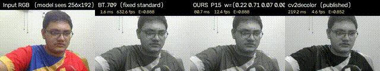
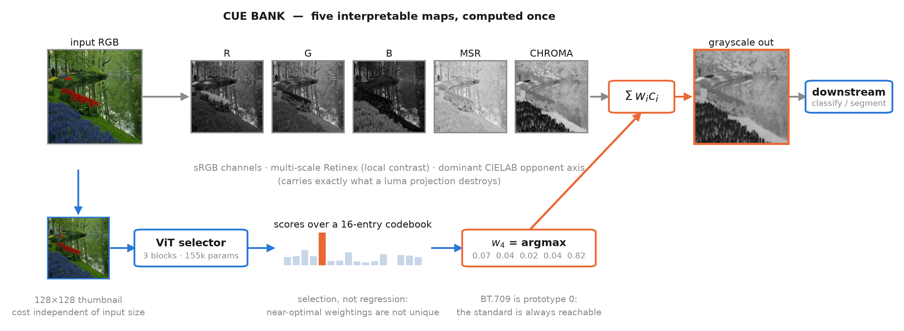

# Per-Image Cue Weighting for Real-Time Decolorization on Edge Devices

> Turn colour images into grayscale that keeps the differences your eyes see in colour — fast enough to run live on a Raspberry Pi.

[](https://doi.org/10.5281/zenodo.22758733)
[](LICENSE)




Ordinary grayscale (the kind a phone's "B&W" filter uses) treats colour as brightness, so two *different* colours that happen to be equally bright collapse into the **same** shade of gray, and whatever they encoded is lost. A red figure on a green background, the coloured regions of a map, the hidden number on a colour-vision plate: standard grayscale can erase them entirely.

This project learns, **per image**, how to blend a small bank of colour cues so those differences survive the conversion. A **155k-parameter** vision transformer (0.64 MB) picks the right blend for each picture in a few milliseconds, small and fast enough to run in real time on a Raspberry Pi.

## In a nutshell


*(a)* colour input, *(b)* standard BT.709 grayscale, the figure has vanished, *(c)* a strong classical baseline, *(d)* ours, the figure is preserved. The score under each grayscale panel is that image's iso-luminant contrast (**CCPR-iso**): higher means more of the colour-only structure survived.

## Results (Color250 benchmark)

| Method | E ↑ | CCPR-iso ↑ | Latency |
|---|---|---|---|
| BT.709 (standard grayscale) | 0.783 | 0.038 | 0.3 ms |
| Lu 2012 (OpenCV `cv2.decolor`) | 0.807 | — | 84 ms |
| **Ours (155k ViT)** | **0.831** | **0.297** | **26 ms desktop · 76 ms Pi 5** |

Our E-score is within 0.001 of the best *offline* optimization method in the paper while running orders of magnitude faster, and it has the **highest iso-luminant contrast (CCPR-iso)** of every method we compared. Full tables (NIQE, BRISQUE, all baselines, four datasets) are in the paper.

## How it works



The input is expanded into a five-cue bank: the R, G, B channels, a multi-scale Retinex response, and the dominant CIELAB opponent-chroma axis. In parallel a 128×128 thumbnail drives the ViT selector, which emits logits over a 16-entry codebook of weightings; the top prototype gives a convex weighting **w** on the cue simplex, and the output is the fused grayscale **g = Σ wᵢcᵢ**. Because the selector reads only the thumbnail, its size and speed are independent of the full image resolution.

## Install

```bash
git clone https://github.com/rayeedaabir/decolorization.git
cd decolorization
pip install -r requirements.txt
```

## Quick start — decolorize one image

```python
# run from the repo root:  PYTHONPATH=src python quick_decolorize.py
import numpy as np
from PIL import Image
from decolorizers import get_any

dec  = get_any("vit:models/fusion_vit.pt:models/codebook.npz")
rgb  = np.asarray(Image.open("input.png").convert("RGB"), np.float64) / 255.0
gray = dec(rgb)                                   # H×W float array in [0,1]
Image.fromarray((gray * 255).astype("uint8")).save("output.png")
```

## Reproduce the paper's figures and ablation

```bash
# Figure 1 — teaser (near-iso-luminant plate, four ways)
python src/make_teaser.py --image data/Cadik_rgb/<plate>.png \
    --ckpt models/fusion_vit.pt --codebook models/codebook.npz \
    --metric both --row --out figures/teaser

# Figure 2 — system overview
python src/make_system_figure.py --image data/Color250_rgb/.png \
    --ckpt models/fusion_vit.pt --codebook models/codebook.npz

# Figure 3 — quality vs. cost (Pareto)
python src/make_pareto.py --no-title --label-ours

# Table V — cue-bank ablation with per-image paired tests
python src/run_cue_ablation.py --paired
```

Datasets are third-party and are not included — see [`data/README.md`](data/README.md).

## Model card

- **Parameters / size:** 155k / 0.64 MB
- **Selector input:** 128×128 RGB thumbnail
- **Output:** index into a 16-entry codebook → convex weighting over the 5-cue simplex
- **Training pipeline:** Dirichlet oracle search (maximising E) → k-means codebook (15 prototypes + BT.709) → ViT classifier
- **Latency:** 26.2 ms desktop (1 CPU thread, 256×256) · 76.4 ms Raspberry Pi 5 (ARM Cortex-A76, 256×256)

## Citation

Paper (submitted to ICASSP 2027 — update on acceptance):

```bibtex
@inproceedings{ahsan2027decolorization,
  title     = {Per-Image Cue Weighting for Real-Time Decolorization on Edge Devices},
  author    = {Ahsan, Rayeed Aabir and Rahman, Rashedur Mohammad},
  booktitle = {Submitted to IEEE Int. Conf. on Acoustics, Speech and Signal Processing (ICASSP)},
  year      = {2027}
}
```

Software archive: see the DOI badge above (`CITATION.cff` has the machine-readable form).

## License

Code is released under the [MIT License](LICENSE). The figures and demonstration video are released under CC-BY-4.0. The evaluation datasets are the property of their respective authors and are not redistributed here.

## Acknowledgments

Developed at North South University. We thank the authors of the Čadík, Color250, UCM, and AID datasets. See the paper for full references.